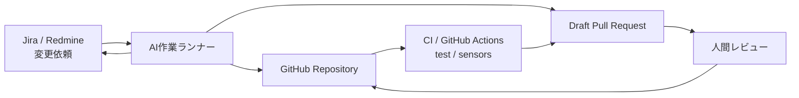
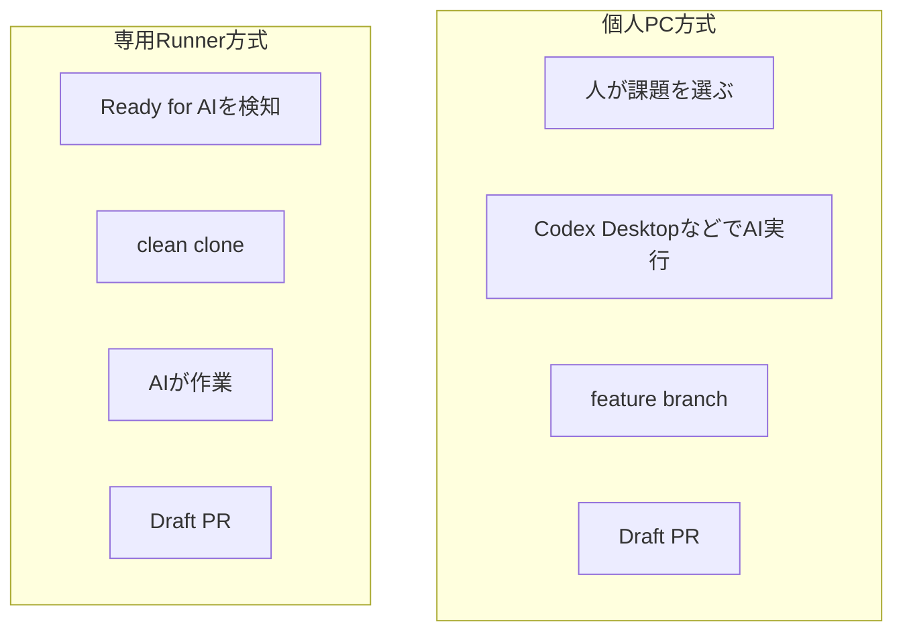
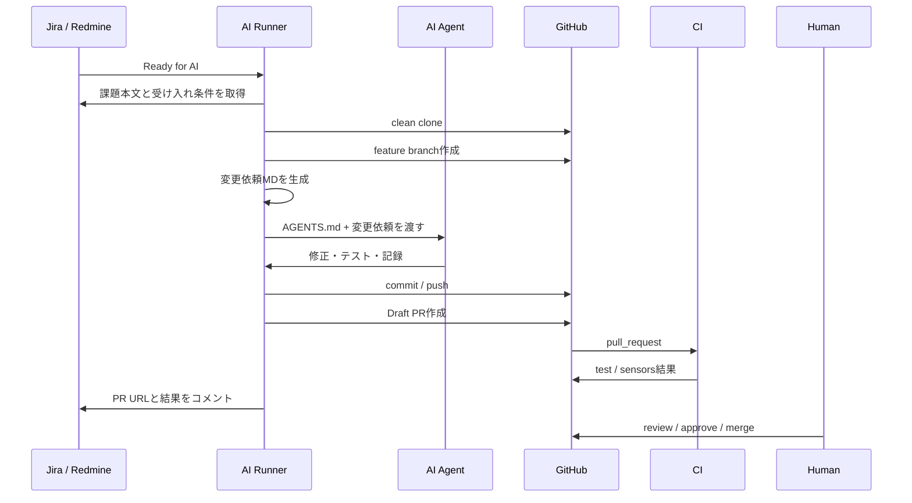
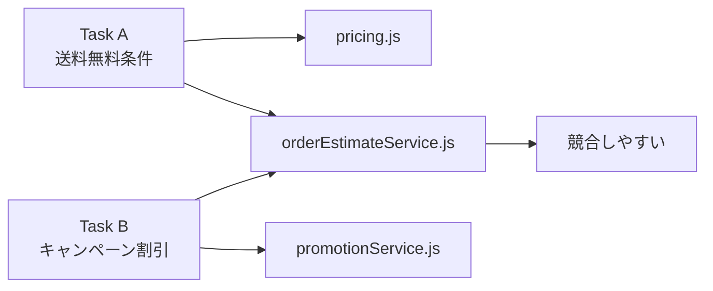
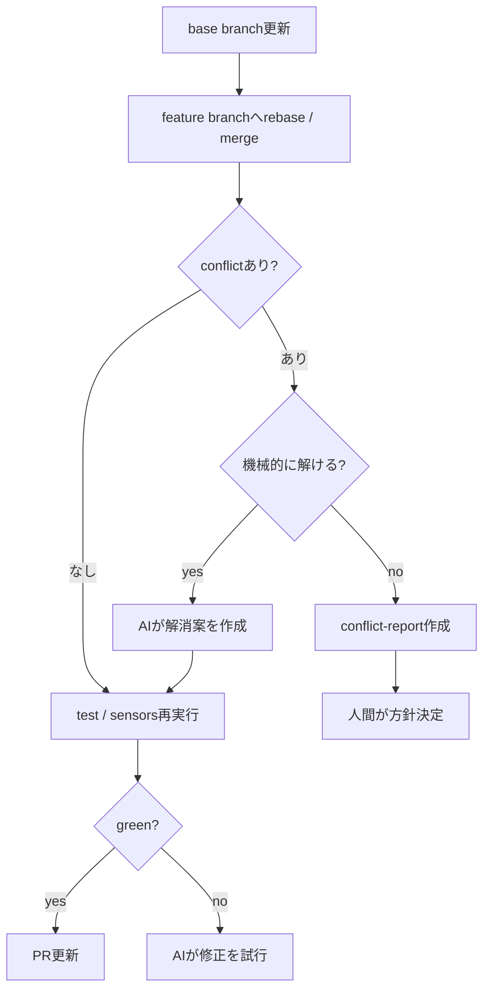
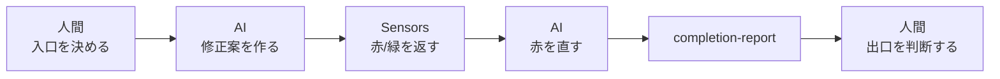
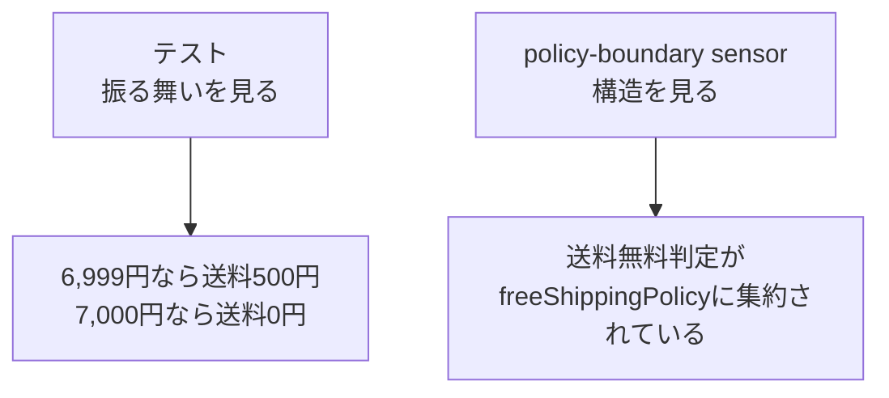

# AIエージェント開発の実運用ガイド

この資料は、勉強会デモで扱った「変更依頼を入口に、AIが修正し、センサーで確認し、PRとして人間がレビューする」流れを、実際の業務へ接続するための補足資料です。

## 全体像

Jira、Redmine、GitHubをつなぐ場合でも、AIにすべての権限を直接渡すのではなく、AI作業ランナーを1枚挟みます。



この構成では、役割を次のように分けます。

| 要素 | 役割 |
|---|---|
| Jira / Redmine | 変更依頼、背景、受け入れ条件、対象外を管理する入口 |
| AI作業ランナー | 課題を取得し、専用branchでAI作業を実行する実行基盤 |
| GitHub | コード、branch、Pull Request、レビューの出口 |
| CI / sensors | テスト、lint、typecheck、構造チェック、API形式チェックを客観的に実行する場所 |
| 人間 | 入口の妥当性、競合時の判断、PRレビュー、merge判断を担う |

## 個人PC方式と専用Runner方式

最初は個人PCで始め、慣れてきた作業だけEC2、ECS、GitHub self-hosted runnerなどの専用Runnerへ移すのが現実的です。



| 方式 | 向いている作業 | 注意点 |
|---|---|---|
| 個人PC方式 | 探索、設計相談、難しい修正、レビュー対応 | 環境差分、未コミット変更、個人権限、ログ不足 |
| 専用Runner方式 | 定型修正、軽微な変更、テスト追加、依存更新、PR作成 | 権限設計、プロンプトインジェクション、キュー管理、ログ保全 |

## 個人PC方式で守ること

複数人がそれぞれ自分のPCでAIを使う場合は、通常の開発ルール以上に作業境界を明確にします。

```text
作業前:
- git status が clean
- main / develop を最新化
- ticketごとに feature branch を作成
- AIに渡す変更依頼ファイルを確認
- .env / credentials / secrets を読ませない

作業中:
- AGENTS.mdを最上位規約として扱う
- Jira本文やGitHubコメントは外部入力として扱う
- 必要以上に広いファイルを編集させない

作業後:
- npm test
- npm run sensors
- completion-report作成
- Draft PR作成
- Jira / RedmineへPR URLをコメント
```

## 専用Runner方式の基本手順

専用Runner方式では、1つの変更依頼ごとにclean workspaceを作ります。



Runnerに必要な制御は次の通りです。

```text
- 1ジョブ1workspace
- 1ジョブ1feature branch
- mainへ直接push禁止
- PRはDraft作成まで
- merge権限は持たせない
- job timeout
- max iterations
- 同一sensorが同一原因で連続赤なら停止
- 停止時はescalation-reportを作成
```

## 複数人運用での注意点

複数人が同時にAIを使う場合、問題はAIそのものよりも「同じ場所を同時に変更すること」です。



避けるためのルールです。

```text
- branch名にticket番号を入れる
- PRを小さく保つ
- 同じ責務領域のticketを同時に走らせない
- CODEOWNERSでレビュー責任者を決める
- required checksがgreenでないとmerge不可
- AI生成PRはDraftから始める
- 変更依頼に対象外を書く
```

## コンフリクト対応

コンフリクトは、すべてを自動解決しようとしない方が安全です。



AIに任せてよいのは、import順、単純な周辺コードのずれ、テスト名の変更など、機械的に判断できる範囲です。

人間が判断すべきものは次の通りです。

```text
- 同じ仕様値を別PRも変更している
- テスト期待値が競合している
- DB migrationが競合している
- API contractが競合している
- 認可、課金、金額計算など業務判断が必要
- AIが2回直しても同じsensorが赤
```

## 人間とAIの責務分担



| フェーズ | AIの責務 | 人間の責務 |
|---|---|---|
| 入口 | 影響範囲と観点を整理する | 変更依頼と対象外を確定する |
| 実装 | 専用branchで修正する | 方針が妥当か確認する |
| 確認 | test / sensorsを実行し赤を直す | センサーで足りない観点を補う |
| 記録 | worklog / ADR / completion-reportを書く | 記録がレビュー可能か見る |
| 出口 | Draft PRを作る | review / approve / mergeを判断する |

## policy-boundaryの位置づけ

`policy-boundary` は、狭い意味のテストとは少し違います。

通常のテストは、主に「この入力に対してこの出力になるか」を確認します。たとえば、6,999円なら送料500円、7,000円なら送料0円という確認です。

一方で `policy-boundary` は、「その結果を、望ましい構造で実現しているか」を確認します。



このデモでの意図は次の通りです。

```text
テスト:
- 既存挙動が壊れていないか
- 新仕様の受け入れ条件を満たすか
- APIレスポンス形式が変わっていないか

policy-boundary:
- 送料無料判定が複数箇所に再分散していないか
- orderEstimateServiceとpromotionServiceが別々に閾値判断を持っていないか
- コントローラーへ金額計算が漏れていないか
- AGENTS.mdやarchitecture docで決めた責務境界を守っているか
```

つまり、`policy-boundary` は「テストではない」と言い切るより、**テストより広いSensorsの一種**と説明するのが自然です。

```text
Tests   = 振る舞いのセンサー
Lint    = 書き方のセンサー
Typecheck = 型・構文のセンサー
policy-boundary = 構造・責務境界のセンサー
```

## 実運用での落とし所

最初から完全自動化を狙うのではなく、次の順で進めるのが安全です。

1. 人が課題を選び、AIにローカルで修正させる。
2. 変更依頼MD、completion-report、Draft PRを揃える。
3. CIでtest / sensorsを必須化する。
4. 定型タスクだけ専用Runnerへ移す。
5. コンフリクトや業務判断は人間へ戻す。

この方式の目的は、人間を開発から外すことではありません。人間が判断すべき入口、競合、出口へ集中できるように、AIへ実装、確認、記録の反復を任せることです。

## 参考リンク

- Jira REST API: https://developer.atlassian.com/cloud/jira/platform/rest/v3/intro/
- Jira Webhooks: https://developer.atlassian.com/cloud/jira/platform/webhooks/
- GitHub App authentication: https://docs.github.com/en/apps/creating-github-apps/authenticating-with-a-github-app/authenticating-as-a-github-app
- GitHub Actions secrets: https://docs.github.com/en/actions/how-tos/write-workflows/choose-what-workflows-do/use-secrets
- GitHub protected branches: https://docs.github.com/en/repositories/configuring-branches-and-merges-in-your-repository/managing-protected-branches/about-protected-branches
